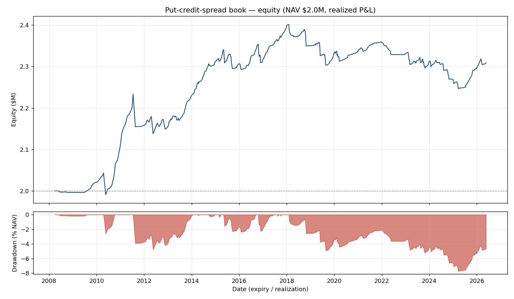
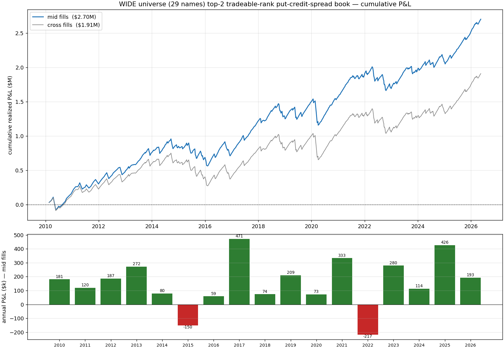
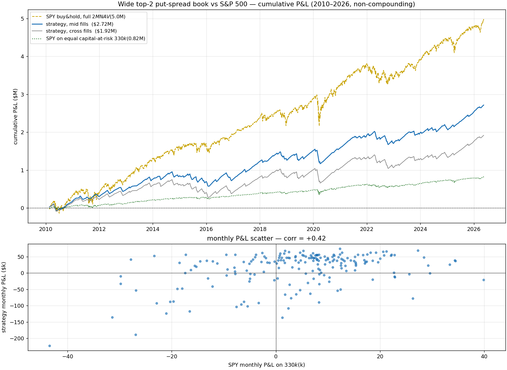
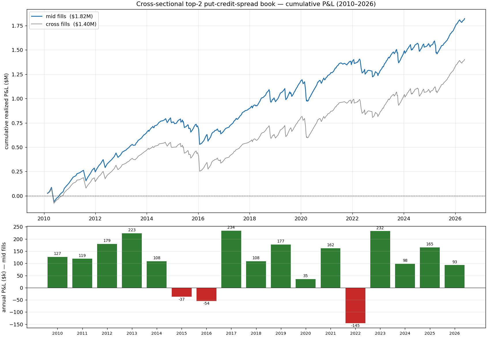

# Cross-Sectional VRP Put-Spread Strategy — Frozen Specification v1.0

_Frozen 2026-06-12 · repo `rv_estimator` @ d438fd8+ · python 3.12.13 / polars 1.41.1 / numpy 2.4.6_

**Status: FROZEN.** This document is the single reference for the strategy: definition, data,
exact reproduction steps, results, caveats, and the evaluation protocol that must run before any
deployment decision. Any change to §2 (the spec) is a new version and resets the evaluation clock.

---

## 0. One-paragraph summary

Each week, rank ~29 liquid ETFs by how rich their options are relative to a bias-corrected
HAR-ensemble forecast of realized variance (`score = log(IV²) − log(rv_hat_cal)`), and sell
defined-risk put-credit spreads (0.25Δ short / 0.10Δ wing, ~30 DTE, hold to expiry) on the **two
richest names that can actually be traded that day**, $40k max-loss per trade. Backtested on real
ORATS chains 2010→2026: **Sharpe 0.66 with worst-case fills, 0.93 with mid fills** (realistic
≈ 0.80), 85% win rate, 15 of 17 years positive, era-stable — strongest *after* 2018, unlike the
original always-on short-vol book this strategy replaced (that book's Sharpe was −0.34 post-2018).
It is an overlay: it consumes ~$330k mean margin on a $2M NAV and lifts a $2M SPY portfolio's
Sharpe from 1.06 to 1.18 despite +0.42 monthly correlation.

## 0.1 This folder is self-contained

| File | Contents |
| --- | --- |
| `FROZEN_STRATEGY_SPEC.md` | this document — the single reference |
| `frozen_run_report.md` / `frozen_run_trades.csv` | the frozen run's report + full per-trade ledger (cross fills) |
| `research_findings_archive.md` | full research trail (signal ceiling, all variants, breadth experiment) |
| `original_book_review_archive.md` | review/verdict of the original book this strategy replaced |
| `images/` | all charts referenced below |

## 1. Provenance — how we got here (the audit trail)

| Doc (in `strategy_backtest/results/`) | What it established |
| --- | --- |
| `BACKTEST_REVIEW_AND_VERDICT.md` | The original v2 gated short-put book is implementation-correct but dead post-2018 (Sharpe −0.34 over 8.4 yrs); the one era-stable asset is the forecaster's **cross-sectional ranking** |
| `XSEC_PIVOT_FINDINGS.md` | Signal ceiling (paper log-L/S Sharpe ~4, rank IC 0.35, positive every year); straddle expressions fail on ATM friction; rank-**selected** put spreads work; breadth (9→29 names) and all variant experiments |
| `xsec_putspread_report_wide_final.md` | The frozen book's headline run output |
| `ensemble_verification.md` | The forecaster implementation verified bit-exact vs its production guide |



## 2. THE FROZEN SPEC

### 2.1 Universe (29 names)

```
Core 9 :  SPY QQQ IWM XLK XLF XLE TLT GLD EEM
Breadth:  XLI XLU XLP XLV XLY XLB DIA EFA FXI EWZ GDX SLV USO XOP SMH XBI IBB KRE XRT IYR
Excluded: HYG — ex-ante liquidity rule (median ATM half-spread 6.1% of premium vs 0.5–2.7%
          for all others; it occupied 45% of top-2 slots and mostly failed the fill filters)
Feature sources (never traded): SPX, VIX chains
```

### 2.2 Signal

- **Forecast** `rv_hat`: EnsembleTopK — equal-weight level-space mean of 4 HAR-family components
  (HARQ, HAR-RS, HAR-CJ, HAR-RS-IV-Q), each an independent per-(ticker, horizon=22) log-OLS,
  walk-forward (expanding window, monthly refits, purged + 1-day-embargoed, `MIN_TRAIN_DAYS=756`,
  `OOS_START=2010-01-01`). Inputs: 5-min realized measures (RV, semivariances, jumps, quarticity)
  from Polygon minute bars + per-ticker ORATS IV features. First prediction 2010-01-04.
- **De-bias** (`pit.trailing_debias`): `rv_hat_cal = rv_hat × exp(median of matured log errors)`,
  where the expanding per-ticker median uses only forecasts whose 22-day realization has closed
  (shift 22 rows, `min_periods=126`). Corrects the forecaster's structural over-prediction
  (median +0.27 log) with zero lookahead.
- **Implied variance** `iv2 = iv_30d² × (22/252)` (ORATS 30-day ATM IV, de-annualized to the
  22-trading-day horizon).
- **Score** `= log(iv2) − log(rv_hat_cal)` — log-richness of options vs forecast RV.

### 2.3 Entry selection (weekly)

1. **Cadence:** every 5th trading day of the common prediction calendar (`ROLL_EVERY=5`);
   a date needs ≥7 names with valid data (`MIN_NAMES_XS=7`).
2. **Absolute-richness gate:** drop names with `score ≤ 0` (only sell what the model says is
   rich outright, `XS_MIN_SCORE=0.0`).
3. **Rank** remaining names by score, descending.
4. **Tradeable-rank walk** (`XS_TRADEABLE=1`): walk down the ranked list; for each name attempt to
   actually open the spread on that day's chain (§2.4 + §2.5 filters); keep the **first 2 that
   fill** (`XS_TOPK=2`). Point-in-time: uses only the entry-day chain. This rule is load-bearing —
   without it, untradeable names hog slots (XLP: 113 selections → 7 fills) and the wide-universe
   Sharpe collapses 0.66 → 0.43.

### 2.4 Structure & exit

| Parameter | Value |
| --- | --- |
| Structure | Put credit spread: sell ~0.25Δ put, buy ~0.10Δ put (strikes by nearest abs delta; ORATS delta col is the call delta, put Δ = callΔ − 1) |
| Expiry | nearest to 30 calendar DTE within [25, 45]; skip if none |
| Exit | **hold to expiry**, settle at intrinsic on expiry-day spot (walk back ≤5 days if session missing). No management arm (managed exits tested and rejected — they lose) |

### 2.5 Liquidity / credit filters (G7, applied at fill time)

| Filter | Value |
| --- | --- |
| Open interest | short leg ≥ 50, wing ≥ 10 |
| Relative spread | (ask−bid)/mid ≤ 0.35 per leg |
| Net credit | ≥ $0.05/share AND credit/width ≥ 0.10 |

### 2.6 Sizing & risk

| Parameter | Value |
| --- | --- |
| Risk per trade | `size_units=1.0 × b=0.02 × NAV $2M` = **$40k max-loss per trade**, contracts = 40k / ((width−credit)×100), nearest-rounded |
| Group margin cap | 20% of NAV per correlation group, **concurrent** accounting (overlapping positions), pro-rata scaling within a (date, group) batch |
| Resulting book | ~8.6 concurrent positions; mean margin $330k, peak $560k; ann P&L vol ≈ 8.8% NAV |
| Scaling policy | Sharpe is invariant to b; backtest maxDD scales linearly ($438k at 1×). ≤2× is defensible; ~$1M mean margin ⇒ backtest maxDD 66% NAV; "50% NAV at all times" ⇒ maxDD > NAV (excluded). Liquidity also binds: median trade is already 112 contracts (p95 476); ≥3× makes you the wing's open interest. Compounding b × current equity is fine. |

### 2.7 Fills & costs

- Entry: cross the bid/ask (worst case) and mid (best case) — report both; reality in between.
- Expiry settlement: intrinsic, no spread, no commission.
- Commissions: $0.65 per contract per leg at entry.
- Measured spread cost (cross vs mid): 23–29% of mid-fill P&L.

## 3. Data requirements & reproduction

### 3.1 Raw data (local mirror `strategy_backtest/back-test-data/`, ~19GB)

| Layer | Layout | Source (Ex-Disk master lakes) |
| --- | --- | --- |
| ORATS chains 2007→ | `orats/ticker=<T>/year=<Y>/data.parquet` | `/Volumes/Ex-Disk/orats_parquet/` |
| Polygon 1-min bars 2003→ | `minute/ticker=<T>/data.parquet` | `.../polygon_parquet/us_stocks_sip/minute_aggs_v1/` |
| Daily proxies (HYG LQD SHY UUP TLT) | `daily/ticker=<T>/data.parquet` | `.../day_aggs_v1/` |
| Corp actions + holidays | `corp_actions/`, `market_holidays.parquet` | `.../corporate_actions/`, `.../reference/` |

Stage any missing ticker: `rsync -a --exclude='._*' <ExDisk source>/ticker=<T> <mirror layer>/`.

### 3.2 Build the forecast cache (≈4 min on M-series)

```bash
zsh strategy_backtest/experiments/build_wide_cache.sh
# = SB_EXTRA_TICKERS=<the 20 breadth names> SB_DATA_ROOT=strategy_backtest/data_wide
#   1) pipeline.setup.prepare_panel   -> inputs.parquet, targets.parquet  (30 tickers)
#   2) pipeline.features              -> features.parquet
#   3) pipeline.walkforward x {HARQ, HARRS, HARCJ, HARRSIVQ, EnsembleTopK} --universe all
# Output: strategy_backtest/data_wide/predictions/EnsembleTopK.parquet (616,765 OOS preds)
# Core-name predictions reproduce the original 10-name cache bit-exact (verified).
```

### 3.3 Run the frozen backtest (≈1 min)

```bash
XS_DATA_ROOT=strategy_backtest/data_wide XS_TOPK=2 XS_TRADEABLE=1 XS_MIN_SCORE=0.0 \
XS_TAG=_wide_final \
.venv/bin/python -m strategy_backtest.experiments.xsec_putspread_topk
# -> results/xsec_putspread_report_wide_final.md + xsec_putspread_trades_wide_final.csv
```

Code inventory: `experiments/xsec_putspread_topk.py` (the strategy), `backtest/` (engine: chains,
marks, structures, sizing, pit — ported, self-contained), `pipeline/` (forecast stack),
`experiments/build_wide_cache.sh`, `experiments/xsec_straddle.py` (rejected alternative, kept for
the record). Universe extension lives in `pipeline/config.py` (`SB_EXTRA_TICKERS` env + GROUP map).

## 4. Results (the frozen run)

| fill | trades | P&L | **Sharpe (monthly)** | maxDD | win | 2010–13 | 2014–17 | 2018–21 | 2022–26 |
| --- | --- | --- | --- | --- | --- | --- | --- | --- | --- |
| cross (worst case) | 1,524 | $1,915,757 | **0.66** | $437,795 | 85% | 0.90 | 0.30 | 0.67 | 0.78 |
| mid (best case) | 1,524 | $2,709,077 | **0.93** | $352,939 | 85% | 1.12 | 0.63 | 0.92 | 1.02 |

15 of 17 years positive (2015 −$150k, 2022 −$217k). Per-trade: $40k risk, median 112 contracts.
Top earners: QQQ $671k, IWM $362k, SPY $246k, GDX/GLD/SLV ~$385k combined; worst: EWZ −$116k,
XLP −$97k (full table in `results/xsec_putspread_report_wide_final.md`).



### 4.1 vs S&P 500 (same window, monthly basis, SPY total return)

| | ann return | Sharpe | note |
| --- | --- | --- | --- |
| SPY $2M buy & hold | 15.2% | 1.06 | exceptional decade; long-run SPY ≈ 0.4–0.5 |
| strategy (mid) | $166k/yr | 0.93 | on ~$330k mean margin ⇒ ~50%/yr on capital-at-risk |
| **$2M SPY + overlay** | — | **1.18** | the sensible deployment; monthly corr +0.42 |



### 4.2 The 9-name baseline (pre-breadth, for reference)

Top-2 of the original 9 ETFs (no tradeable-walk, no score gate): cross 0.68 / mid 0.85.
Breadth bought ~35% more P&L, a higher mid bound (0.93), smaller maxDD/P&L, and halved QQQ
dependence — but **not** √N Sharpe scaling (common crash factor; edge concentrates in ranks 1–2).



## 5. Variants tested and REJECTED (do not re-litigate without new evidence)

| Variant | Result | Why it fails |
| --- | --- | --- |
| Original v2 gated book (G2/G3/G4 + VRP size-tilt) | −0.34 Sharpe post-2018 | gates kill the cross-section; aggregate short-vol beta died |
| L/S delta-hedged ATM straddles (top/bot-3) | −0.50 full friction; +0.57 frictionless | ATM crossing eats 1.9× the edge; long-vol leg loses ~$1M even frictionless |
| 60-DTE straddles, short-only straddles | ≤0.70, fat tails | friction + naked-short tails |
| K=4 / K=6 (more positions) | 0.29 / 0.20 | edge lives in ranks 1–2; deeper picks stack crash beta (maxDD ×3) |
| Group-distinct top-K | 0.54 | doubled-up top picks were genuinely best |
| 6-monthly worst-ticker ban (trailing 2y P&L) | 0.66/0.90, era churn | per-name performance not persistent (rank-corr +0.15, sign-flips); banned QQQ '13, SPY '20 |
| Managed exits (profit-take/stops/term-flip) | −$129k vs +$309k hold | whipsaw; X5 stop alone −$499k |

## 6. Known caveats (read before believing the numbers)

1. **Multiplicity.** Structure, K=2, log-score, HYG exclusion, tradeable-walk, score>0 were chosen
   on this same 2010–2026 sample across many explored forks (see §5 and `XSEC_PIVOT_FINDINGS.md`).
   The true expectation is below the point estimates. This is the main reason for §7.
2. **Realization-dated P&L.** The daily series books P&L at exit; intra-trade MTM swings are not
   in the Sharpe/maxDD. (The rejected straddle sleeve numbers WERE true MTM; this book's are not.)
3. **Fill bounds.** Cross = worst case, mid = best case; live sits in between (~0.80 expected).
   The mid bound assumes current clip sizes (~112 contracts median) — it degrades at ≥3× size.
4. **Same-day signal→fill:** entries fill at the same EOD chain that produced the signal.
5. **Short-vol skew:** +0.42 SPY correlation; the book is long equity beta in crashes. The
   crash-factor hedge (§8) is designed-but-not-tested, deliberately.

## 7. Pre-registered evaluation protocol (MANDATORY before deployment)

1. **No further tuning.** Any spec change ⇒ version bump, evaluation restarts.
2. **Paper-trade / shadow-run** the frozen spec live for ≥2 quarters (~26 weekly cohorts):
   record actual fills vs the cross/mid bounds, MTM daily P&L, margin usage.
3. **Pass criteria (set now):** realized monthly Sharpe of the shadow book > 0.4 (the bottom of
   the honest expectation band); realized fill quality ≤ 40% of half-spread; no maxDD > 15% of
   deployed margin beyond what the same weeks' backtest shows.
4. **Kill rule (live, set now):** stop if trailing 3-year Sharpe < 0 (the rule that would have
   stopped the original book in 2021), or if a single month loses > 2× the backtest's worst
   month at the deployed scale.
5. **Size at start:** b = 0.02 ($40k/trade at $2M). Raise toward 2× only after the §7.2 evaluation
   passes; never past the liquidity ceiling (§2.6).

## 8. Open improvement levers (next version, ex-ante designs only)

1. **Execution** — the cross→mid gap is worth +0.27 Sharpe; patient limit orders at ~100-contract
   clips on liquid ETF options should capture ≥half.
2. **Crash-factor hedge** — finance a small SPY tail put overlay out of the spread richness;
   design the rule before looking at this sample's P&L (the one variant deliberately left untested
   to keep it honest).
3. **Second sleeve** — the short-only straddle book (0.70 daily-MTM Sharpe, different P&L path)
   blended at vol weights; requires re-marking this book MTM first for covariance.
4. **Model-skill name screen** — replace the rejected P&L-ban with a trailing forecast-quality
   screen (QLIKE / log-error variance vs IV-only baseline, ~250 obs/name/yr); designable PIT.
5. **More breadth done right** — additional *liquid* names help capacity (not Sharpe); single-name
   options would need earnings handling the current pipeline lacks.
