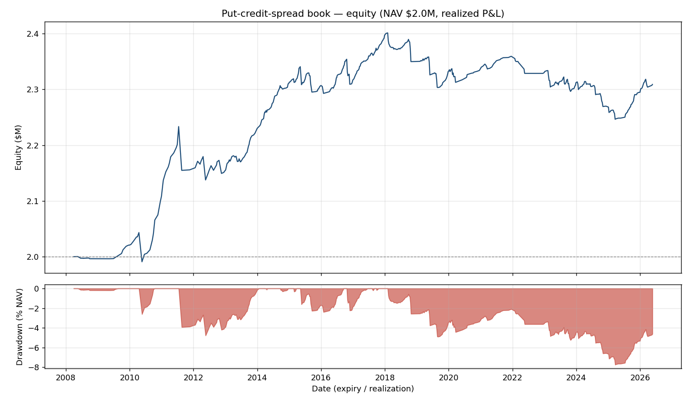
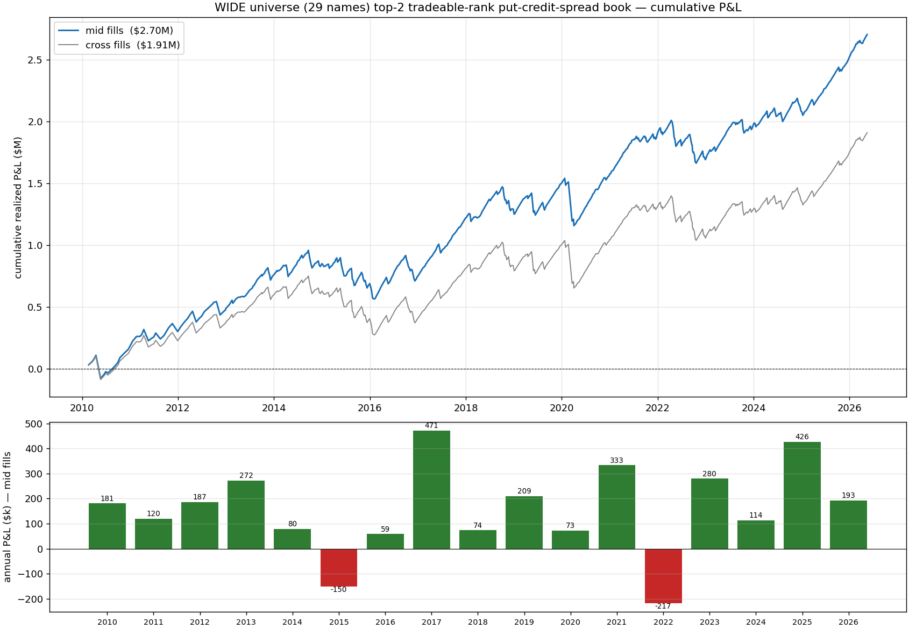
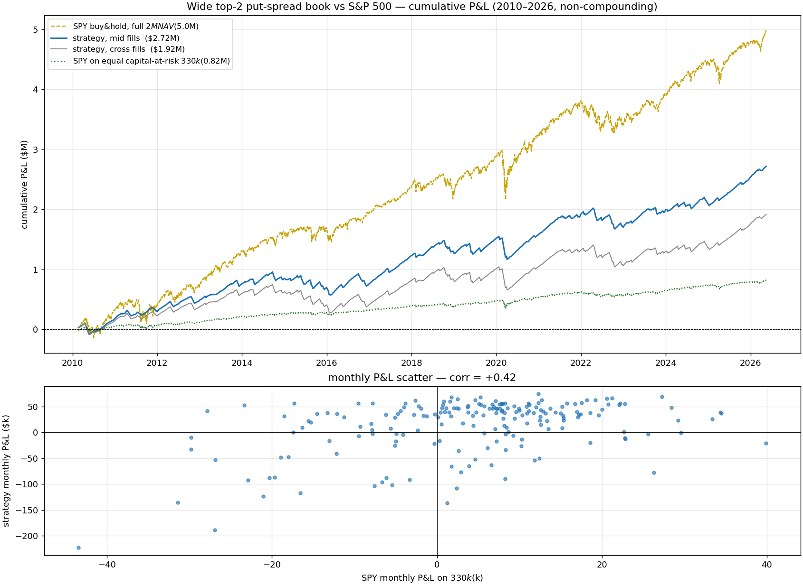
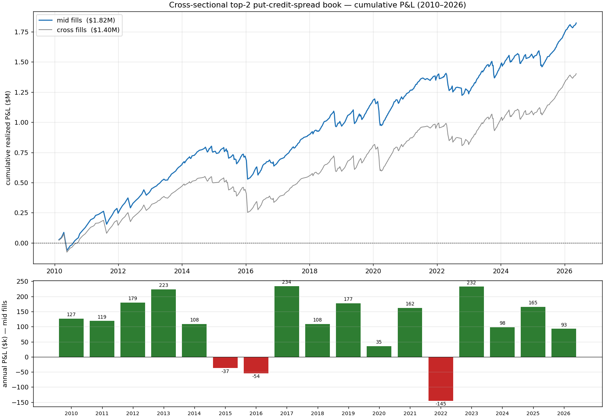

# Cross-Sectional VRP Put-Spread Strategy — Frozen Specification v1.0

_Frozen 2026-06-12 · repo `rv_estimator` @ d438fd8+ · python 3.12.13 / polars 1.41.1 / numpy 2.4.6_

**Status: FROZEN.** This document is the single reference for the strategy: definition, data,
exact reproduction steps, results, caveats, and the evaluation protocol that must run before any
deployment decision. Any change to §2 (the spec) is a new version and resets the evaluation clock.

_Addendum 2026-07-09: §4.3, §5, §6, §7 and §8 updated with the hole-digging program's measured
numbers (`results/HOLE_DIGGING_REPORT.md`). No §2 change — v1.0 stands. The proposed v1.1 lives in
`STRATEGY_SPEC_v1.1_DRAFT.md`._

---

## 0. One-paragraph summary

Each week, rank ~29 liquid ETFs by how rich their options are relative to a bias-corrected
HAR-ensemble forecast of realized variance (`score = log(IV²) − log(rv_hat_cal)`), and sell
defined-risk put-credit spreads (0.25Δ short / 0.10Δ wing, ~30 DTE, hold to expiry) on the **two
richest names that can actually be traded that day**, $40k max-loss per trade. Backtested on real
ORATS chains 2010→2026: **Sharpe 0.66 with worst-case fills, 0.93 with mid fills** (realistic
≈ 0.80), 85% win rate, 15 of 17 years positive, era-stable — strongest *after* 2018, unlike the
original always-on short-vol book this strategy replaced (that book's Sharpe was −0.34 post-2018).
It is an overlay: it consumes ~$330k mean margin on a $2M NAV and lifts a $2M SPY portfolio's
Sharpe from 1.06 to 1.18 despite +0.42 monthly correlation.

## 0.1 This folder is self-contained

| File | Contents |
| --- | --- |
| `FROZEN_STRATEGY_SPEC.md` | this document — the single reference |
| `frozen_run_report.md` / `frozen_run_trades.csv` | the frozen run's report + full per-trade ledger (cross fills) |
| `research_findings_archive.md` | full research trail (signal ceiling, all variants, breadth experiment) |
| `original_book_review_archive.md` | review/verdict of the original book this strategy replaced |
| `images/` | all charts referenced below |

## 1. Provenance — how we got here (the audit trail)

| Doc (in `strategy_backtest/results/`) | What it established |
| --- | --- |
| `BACKTEST_REVIEW_AND_VERDICT.md` | The original v2 gated short-put book is implementation-correct but dead post-2018 (Sharpe −0.34 over 8.4 yrs); the one era-stable asset is the forecaster's **cross-sectional ranking** |
| `XSEC_PIVOT_FINDINGS.md` | Signal ceiling (paper log-L/S Sharpe ~4, rank IC 0.35, positive every year); straddle expressions fail on ATM friction; rank-**selected** put spreads work; breadth (9→29 names) and all variant experiments |
| `xsec_putspread_report_wide_final.md` | The frozen book's headline run output |
| `ensemble_verification.md` | The forecaster implementation verified bit-exact vs its production guide |



## 2. THE FROZEN SPEC

### 2.1 Universe (29 names)

```
Core 9 :  SPY QQQ IWM XLK XLF XLE TLT GLD EEM
Breadth:  XLI XLU XLP XLV XLY XLB DIA EFA FXI EWZ GDX SLV USO XOP SMH XBI IBB KRE XRT IYR
Excluded: HYG — ex-ante liquidity rule (median ATM half-spread 6.1% of premium vs 0.5–2.7%
          for all others; it occupied 45% of top-2 slots and mostly failed the fill filters)
Feature sources (never traded): SPX, VIX chains
```

### 2.2 Signal

- **Forecast** `rv_hat`: EnsembleTopK — equal-weight level-space mean of 4 HAR-family components
  (HARQ, HAR-RS, HAR-CJ, HAR-RS-IV-Q), each an independent per-(ticker, horizon=22) log-OLS,
  walk-forward (expanding window, monthly refits, purged + 1-day-embargoed, `MIN_TRAIN_DAYS=756`,
  `OOS_START=2010-01-01`). Inputs: 5-min realized measures (RV, semivariances, jumps, quarticity)
  from Polygon minute bars + per-ticker ORATS IV features. First prediction 2010-01-04.
  - **What each component regresses on** (all share the Corsi-HAR backbone `log_rv_{d,w,m}` =
    log of today's / trailing-5d / trailing-22d daily total RV; each is a plain log-OLS of
    `log(target_var)` on its features, fit independently per (ticker, horizon), no hyperparameter,
    no seed):

    | Component | Extra features beyond the HAR backbone | Signal it adds |
    | --- | --- | --- |
    | **HARQ** | `sqrt_rq` (√ realized quarticity) | Down-weights `RV_{t−1}` when that day's RV was a noisy estimate (measurement-error fix) |
    | **HAR-RS** | `rs_minus_5d, rs_plus_5d, jump_5d` (down/up semivariance + jump) | "Downside RV predicts future RV; upside/jumps largely don't" — the most put-relevant decomposition |
    | **HAR-CJ** | `log_bv_{d,w,m}, log_jump_d` (bipower continuous part + jump) | Separates persistent smooth vol from transitory jumps |
    | **HAR-RS-IV-Q** | HAR-RS + `sqrt_rq` + IV block (`log_iv, iv_slope, skew_25d, vix, vix3m, vix_slope, vvix`) | The only **forward-looking** member — injects the market's own IV/VIX term-structure view |
  - **Combiner** (parameter-free; `fit()` is a no-op, no calibration layer): for each key,
    `rv_hat = mean(component rv_hat)` in variance space and
    `sigma = √(mean(component σ²) + var(component rv_hat))` (within-model uncertainty + between-model
    dispersion — the term that widens the interval exactly when the four views disagree). A key needs
    **≥2** finite-positive components or it is dropped, never imputed. `rv_hat` = point forecast of
    forward realized variance `E[Σ_{s=t+1..t+22} RV_s]`. (Verified bit-exact vs the production guide —
    `results/ensemble_verification.md`.)
- **De-bias** (`pit.trailing_debias`): `rv_hat_cal = rv_hat × exp(median of matured log errors)`,
  where the expanding per-ticker median uses only forecasts whose 22-day realization has closed
  (shift 22 rows, `min_periods=126`). Corrects the forecaster's structural over-prediction
  (median +0.27 log) with zero lookahead.
- **Implied variance** `iv2 = iv_30d² × (22/252)` (ORATS 30-day ATM IV, de-annualized to the
  22-trading-day horizon).
- **Score** `= log(iv2) − log(rv_hat_cal)` — log-richness of options vs forecast RV.
- **What the forecast does / does not add.** At h=22 the forecast carries **~no per-name directional
  mean-alpha over IV²** (incremental-skill sign-accuracy ≈ 0.52, a coin-flip — production guide §5;
  robust, two later attacks failed). This book does **not** rely on that: it drops the production
  gate + σ-sizing that guide anticipated (§2.3) and instead extracts the forecast's **cross-sectional**
  skill — ranking names by richness — which is strongly significant (rank-IC ≈ +0.29, §4.3) and is not
  replaceable by a trivial trailing-RV forecast (§4.4). Time-series directional skill ≈ 0 and
  cross-sectional ranking skill ≫ 0 are consistent: they are different claims.

**Model reference (authoritative, self-contained elsewhere):** full spec of the forecaster — the four
components, per-(ticker,horizon) training, the combiner, the refit/walk-forward protocol, calibration,
and why K=4 / equal-weight / not-one-big-regression — is `plan_docs/ENSEMBLETOPK_PRODUCTION_GUIDE.md`.
Source: `candidate_models/{ensemble_top,harq,har_rs,har_cj,har_rs_iv_q}.py` on base classes in
`rv_eval/model_contract.py`, features in `rv_eval/features.py`; self-stats card
`candidate_models/cards/EnsembleTopK.md`. (Guide numbers quoting `OOS_START=2018` are the rv_eval eval
sample; this backtest refits from `OOS_START=2010` per `pipeline/config.py` — see §3.2.)

### 2.3 Entry selection (weekly)

1. **Cadence:** every 5th trading day of the common prediction calendar (`ROLL_EVERY=5`);
   a date needs ≥7 names with valid data (`MIN_NAMES_XS=7`).
2. **Absolute-richness gate:** drop names with `score ≤ 0` (only sell what the model says is
   rich outright, `XS_MIN_SCORE=0.0`).
3. **Rank** remaining names by score, descending.
4. **Tradeable-rank walk** (`XS_TRADEABLE=1`): walk down the ranked list; for each name attempt to
   actually open the spread on that day's chain (§2.4 + §2.5 filters); keep the **first 2 that
   fill** (`XS_TOPK=2`). Point-in-time: uses only the entry-day chain. This rule is load-bearing —
   without it, untradeable names hog slots (XLP: 113 selections → 7 fills) and the wide-universe
   Sharpe collapses 0.66 → 0.43.

### 2.4 Structure & exit

| Parameter | Value |
| --- | --- |
| Structure | Put credit spread: sell ~0.25Δ put, buy ~0.10Δ put (strikes by nearest abs delta; ORATS delta col is the call delta, put Δ = callΔ − 1) |
| Expiry | nearest to 30 calendar DTE within [25, 45]; skip if none |
| Exit | **hold to expiry**, settle at intrinsic on expiry-day spot (walk back ≤5 days if session missing). No management arm (managed exits tested and rejected — they lose) |

### 2.5 Liquidity / credit filters (G7, applied at fill time)

| Filter | Value |
| --- | --- |
| Open interest | short leg ≥ 50, wing ≥ 10 |
| Relative spread | (ask−bid)/mid ≤ 0.35 per leg |
| Net credit | ≥ $0.05/share AND credit/width ≥ 0.10 |

### 2.6 Sizing & risk

| Parameter | Value |
| --- | --- |
| Risk per trade | `size_units=1.0 × b=0.02 × NAV $2M` = **$40k max-loss per trade**, contracts = 40k / ((width−credit)×100), nearest-rounded |
| Group margin cap | 20% of NAV per correlation group, **concurrent** accounting (overlapping positions), pro-rata scaling within a (date, group) batch |
| Resulting book | ~8.6 concurrent positions; mean margin $330k, peak $560k; ann P&L vol ≈ 8.8% NAV |
| Scaling policy | Sharpe is invariant to b; backtest maxDD scales linearly ($438k at 1×). ≤2× is defensible; ~$1M mean margin ⇒ backtest maxDD 66% NAV; "50% NAV at all times" ⇒ maxDD > NAV (excluded). Liquidity also binds: median trade is already 112 contracts (p95 476); ≥3× makes you the wing's open interest. Compounding b × current equity is fine. |

### 2.7 Fills & costs

- Entry: cross the bid/ask (worst case) and mid (best case) — report both; reality in between.
- Expiry settlement: intrinsic, no spread, no commission.
- Commissions: $0.65 per contract per leg at entry.
- Measured spread cost (cross vs mid): 23–29% of mid-fill P&L.

## 3. Data requirements & reproduction

### 3.1 Raw data (local mirror `strategy_backtest/back-test-data/`, ~19GB)

| Layer | Layout | Source (Ex-Disk master lakes) |
| --- | --- | --- |
| ORATS chains 2007→ | `orats/ticker=<T>/year=<Y>/data.parquet` | `/Volumes/Ex-Disk/orats_parquet/` |
| Polygon 1-min bars 2003→ | `minute/ticker=<T>/data.parquet` | `.../polygon_parquet/us_stocks_sip/minute_aggs_v1/` |
| Daily proxies (HYG LQD SHY UUP TLT) | `daily/ticker=<T>/data.parquet` | `.../day_aggs_v1/` |
| Corp actions + holidays | `corp_actions/`, `market_holidays.parquet` | `.../corporate_actions/`, `.../reference/` |

Stage any missing ticker: `rsync -a --exclude='._*' <ExDisk source>/ticker=<T> <mirror layer>/`.

### 3.2 Build the forecast cache (≈4 min on M-series)

```bash
zsh strategy_backtest/experiments/build_wide_cache.sh
# = SB_EXTRA_TICKERS=<the 20 breadth names> SB_DATA_ROOT=strategy_backtest/data_wide
#   1) pipeline.setup.prepare_panel   -> inputs.parquet, targets.parquet  (30 tickers)
#   2) pipeline.features              -> features.parquet
#   3) pipeline.walkforward x {HARQ, HARRS, HARCJ, HARRSIVQ, EnsembleTopK} --universe all
# Output: strategy_backtest/data_wide/predictions/EnsembleTopK.parquet (616,765 OOS preds)
# Core-name predictions reproduce the original 10-name cache bit-exact (verified).
```

### 3.3 Run the frozen backtest (≈1 min)

```bash
XS_DATA_ROOT=strategy_backtest/data_wide XS_TOPK=2 XS_TRADEABLE=1 XS_MIN_SCORE=0.0 \
XS_TAG=_wide_final \
.venv/bin/python -m strategy_backtest.experiments.xsec_putspread_topk
# -> results/xsec_putspread_report_wide_final.md + xsec_putspread_trades_wide_final.csv
```

Code inventory: `experiments/xsec_putspread_topk.py` (the strategy), `backtest/` (engine: chains,
marks, structures, sizing, pit — ported, self-contained), `pipeline/` (forecast stack),
`experiments/build_wide_cache.sh`, `experiments/xsec_straddle.py` (rejected alternative, kept for
the record). Universe extension lives in `pipeline/config.py` (`SB_EXTRA_TICKERS` env + GROUP map).

## 4. Results (the frozen run)

| fill | trades | P&L | **Sharpe (monthly)** | maxDD | win | 2010–13 | 2014–17 | 2018–21 | 2022–26 |
| --- | --- | --- | --- | --- | --- | --- | --- | --- | --- |
| cross (worst case) | 1,524 | $1,915,757 | **0.66** | $437,795 | 85% | 0.90 | 0.30 | 0.67 | 0.78 |
| mid (best case) | 1,524 | $2,709,077 | **0.93** | $352,939 | 85% | 1.12 | 0.63 | 0.92 | 1.02 |

15 of 17 years positive (2015 −$150k, 2022 −$217k). Per-trade: $40k risk, median 112 contracts.
Top earners: QQQ $671k, IWM $362k, SPY $246k, GDX/GLD/SLV ~$385k combined; worst: EWZ −$116k,
XLP −$97k (full table in `results/xsec_putspread_report_wide_final.md`).



### 4.1 vs S&P 500 (same window, monthly basis, SPY total return)

| | ann return | Sharpe | note |
| --- | --- | --- | --- |
| SPY $2M buy & hold | 15.2% | 1.06 | exceptional decade; long-run SPY ≈ 0.4–0.5 |
| strategy (mid) | $166k/yr | 0.93 | on ~$330k mean margin ⇒ ~50%/yr on capital-at-risk |
| **$2M SPY + overlay** | — | **1.18** | the sensible deployment; monthly corr +0.42 |



### 4.2 The 9-name baseline (pre-breadth, for reference)

Top-2 of the original 9 ETFs (no tradeable-walk, no score gate): cross 0.68 / mid 0.85.
Breadth bought ~35% more P&L, a higher mid bound (0.93), smaller maxDD/P&L, and halved QQQ
dependence — but **not** √N Sharpe scaling (common crash factor; edge concentrates in ranks 1–2).



### 4.3 What the edge actually is — cross-sectional ranking (and why it isn't luck)

The edge is **not** per-name variance-forecasting accuracy. It is that ranking the universe by
`score = log(iv²) − log(rv_hat_cal)` sorts names by their *realized* IV-richness: the top-ranked
names are the ones whose options were genuinely rich that week, and selling them harvests a real
cross-sectional dispersion in the vol-risk-premium. This is why selection (top-2), not size-tilt or
per-name gating, is the load-bearing operation.

**Direct test of the mechanism.** For each weekly cohort (the traded set: `score > 0`, ≥7 names,
805 cohorts 2010→2026), rank-correlate the signal against the realized payoff proxy
`realized_richness = log(iv²) − log(target_var)` (same log units as `score`; PIT — `score` uses the
de-biased `rv_hat_cal` exactly as traded):

| quantity | value |
| --- | --- |
| **Rank-IC** `Spearman(score, realized_richness)` per cohort | mean **+0.246**, median +0.26, **positive in 80% of weeks**, t ≈ **25** |
| **Top-2 selection edge** (realized richness of the 2 picked − cohort mean) | **+0.116**, positive 73% of weeks, t ≈ 13 |
| **Permutation null** (shuffle realized-within-date, 2000 draws) | null IC = 0.000 ± 0.007 ⇒ observed **≈34σ out, p < 0.0005** |

The selection captures genuine cross-sectional information; it is **not luck at the signal level**.
(This corroborates the ~0.35 rank-IC in `XSEC_PIVOT_FINDINGS.md`, measured there on the L/S.)

**Two further legs (2026-07-09).** (i) *Random-pick P&L null* (`results/xsec_putspread_nullpick.md`):
replacing the score-rank with a random permutation of each weekly gated cohort — identical gate,
tradeable-walk, engine, sizing, cross fills — yields null Sharpe **0.16 ± 0.09**; the frozen 0.66
sits ≈5.5 null-sd out. Selection pays in realized dollars, not just rank-IC; the §6.6 pair baseline
ties at cross because of SPY/QQQ's *execution* advantage, a different edge. (ii) *Crash-factor
regression* (`results/frozen_stats.md`): monthly P&L on SPY, min(SPY,0) and ΔVIX (Newey-West)
leaves residual α **$199k/yr (t = 2.75)** — the book is short the crash factor (convexity β 0.45)
but is not only that. (iii) *Recency*: per-year rank-IC shows no decay — trailing-2y +0.205 vs
full-sample +0.248; 2025 = +0.299.

**Why per-name P&L is the wrong lens.** Realized P&L for any single name is dominated by how often
it was picked, the handful of crashes it straddled, and its vol-of-vol level — mostly noise around a
common short-vol factor (some names have <5 trades). Per-name *forecast skill* (QLIKE, log-error
variance) therefore shows ~zero-to-negative rank-correlation with per-name P&L, and is not itself
persistent across sub-samples. This is a property of the estimator, **not** evidence the edge is
luck — and it is exactly why per-name screens (the trailing-P&L ban in §5, and the model-skill
screen in §8.4) do not help: they operate at the resolution where there is only noise, while the
edge lives in the cross-section.

**Two things to keep straight.** (i) A robust *signal* edge (above) is not the same as an unbiased
*headline Sharpe*: the 0.66/0.93 point estimates are still multiplicity-inflated (§6.1). (ii) The
only real guarantee remains true out-of-sample — the pre-registered shadow run in §7. The
permutation test is the *ex-ante* confidence; the shadow run is the *ex-post* proof.

### 4.4 The forecaster is load-bearing — a trivial trailing-RV score is NOT a substitute

A natural challenge to §4.3: if the edge is just "sell the names whose IV is rich vs their RV," does
the HAR ensemble matter, or would a trivial RV estimate do? Ablation: re-run the **entire** frozen
book (same universe, cadence, `score>0` gate, tradeable-walk, structure, sizing, fills, settlement)
with the *only* change being the RV used in the score —

- **model** : `score = log(iv²) − log(rv_hat_cal)`  (EnsembleTopK, de-biased — the frozen book)
- **trail** : `score = log(iv²) − log(trailing_22d_RV)`  (sum of the past 22 daily `total_rv`, no model)

| predictor | fill | trades | P&L | Sharpe | maxDD | win | 2010–13 | 2014–17 | 2018–21 | 2022–26 |
| --- | --- | --- | --- | --- | --- | --- | --- | --- | --- | --- |
| model | cross | 1525 | $1,910,752 | **0.66** | $442,801 | 85% | 0.90 | 0.30 | 0.67 | 0.78 |
| model | mid | 1525 | $2,704,937 | **0.93** | $357,078 | 85% | 1.12 | 0.63 | 0.92 | 1.02 |
| trail | cross | 1266 | $71,237 | **0.02** | $559,228 | 81% | 0.07 | 0.11 | **−0.18** | 0.07 |
| trail | mid | 1434 | $1,100,275 | **0.34** | $468,589 | 82% | 0.29 | 0.71 | −0.03 | 0.43 |

(The model arm reproduces the frozen headline bit-for-bit — 1525 vs 1524 trades is one boundary
date — validating that this ablation harness is the frozen engine.)

**Trailing RV yields a dead book: 0.02 cross / 0.34 mid, $71k vs the model's $1.91M — a ~27× P&L
gap at worst-case fills.** The forecaster *is* the strategy, not a garnish.

**The trap: rank-IC massively understates the model's value.** At the signal level the trivial
predictor looks nearly as good — it captures **86%** of the model's cross-sectional rank-IC and 82%
of its top-2 selection edge:

| ranking signal (ungated, 815 weekly cohorts) | rank-IC | top-2 selection edge |
| --- | --- | --- |
| model `log(iv²) − log(rv_hat_cal)` | +0.289 | +0.135 |
| trailing RV `log(iv²) − log(trail_RV)` | +0.250 (86%) | +0.111 (82%) |
| IV-level only `log(iv²)` *(no RV predictor)* | +0.029 | +0.020 |
| inverse-RV only `−log(trail_RV)` *(no iv²)* | +0.058 | −0.003 |

Yet that 14%-IC gap is the whole difference between deployable and dead, for three reasons — the
same reasons rank-IC (which weights all names equally) can't see:

1. **The edge is in the tails / trap-avoidance.** Trailing RV over-picks structurally-high-vol names
   (EWZ, USO, FXI, TLT) whose IV looks rich *against a trailing average* but whose forward RV is
   genuinely high — exactly where short put-spreads get run over (trailing maxDD $559k > model
   $443k). The de-biased model forecasts that high forward RV and deflates those scores.
2. **It under-picks the best name.** Trailing selects QQQ 53× vs the model's 226×, forgoing the
   single biggest earner.
3. **It fails the regime the pivot exists for.** Trailing is *negative in 2018–21* (−0.18 cross);
   the model is strongest post-2018. Trailing RV re-inherits the exact post-2018 death (Sharpe
   −0.34) that killed the original always-on book (§1) — because it lacks the cross-sectional
   forecast skill.

Also note the fill-sensitivity: trailing's edge is so thin that crossing the spread eats ~94% of it
($71k cross vs $1.10M mid), as its picks skew to lower-premium / worse-liquidity names. The two
tables together are the cleanest statement of what this strategy is: cross-sectional VRP ranking
(§4.3) made *tradeable* by a genuine RV forecast — and the correct KPI for that forecast is realized
P&L in the tails, not pooled rank-IC.

_Repro: `experiments/xsec_putspread_trailing.py` (runs both predictors × both fills in one process)._

## 5. Variants tested and REJECTED (do not re-litigate without new evidence)

| Variant | Result | Why it fails |
| --- | --- | --- |
| Original v2 gated book (G2/G3/G4 + VRP size-tilt) | −0.34 Sharpe post-2018 | gates kill the cross-section; aggregate short-vol beta died |
| L/S delta-hedged ATM straddles (top/bot-3) | −0.50 full friction; +0.57 frictionless | ATM crossing eats 1.9× the edge; long-vol leg loses ~$1M even frictionless |
| 60-DTE straddles, short-only straddles | ≤0.70, fat tails | friction + naked-short tails |
| K=4 / K=6 (more positions) | 0.29 / 0.20 | edge lives in ranks 1–2; deeper picks stack crash beta (maxDD ×3) |
| Group-distinct top-K | 0.54 | doubled-up top picks were genuinely best |
| 6-monthly worst-ticker ban (trailing 2y P&L) | 0.66/0.90, era churn | per-name performance not persistent (rank-corr +0.15, sign-flips); banned QQQ '13, SPY '20 |
| Managed exits (profit-take/stops/term-flip) | −$129k vs +$309k hold | whipsaw; X5 stop alone −$499k |
| Trailing-22d-RV score (replace the model forecast) | 0.02 cross / 0.34 mid, $71k P&L | trivial RV mis-prices high-vol trap names (EWZ/USO), under-picks QQQ, negative 2018–21; keeps 86% of rank-IC but ~1/27th the P&L (§4.4) |
| Additive pair-core + non-pair overlay (the §8.6 idea, trade-level) | 0.44 cross / 0.67 mid | doubles gross short-vol (sleeve corr 0.47) and strips QQQ from the overlay; blend *whole* books at half size instead (0.74 cross, §6.6) — `results/xsec_putspread_v11.md` |
| Vol-targeted sizing (EWMA book-vol on the true MTM path, lagged, mean-leverage 1) | MTM 0.55 → 0.46 daily / 0.47 monthly, maxDD +50% | the book's realized vol is lowest right *before* vol events — trailing-vol targeting levers up into the storm — `results/frozen_voltarget.md` |
| Always-on SPY tail-put hedge; spike monetization; VIX & IV-rank entry gates | all rejected | high-VIX weeks are the book's best trades; entry gates can't close pre-spike positions; monetizing caps the convexity you paid for. ⚠ artifacts lost (never committed) — numbers survive only in the 2026-07 memory record; rebuild before re-litigating. Keeper: conditional `vix≥vix3m` hold hedge, Sharpe-neutral crash-beta reducer |

## 6. Known caveats (read before believing the numbers)

1. **Multiplicity — now quantified** (2026-07-09, `results/frozen_stats.md`). Structure, K=2,
   log-score, HYG exclusion, tradeable-walk, score>0 were chosen on this same 2010–2026 sample
   across many explored forks (see §5 and `XSEC_PIVOT_FINDINGS.md`). Stationary-bootstrap 90% CI
   on the cross 0.66 is **[0.22, 1.15]**; **deflated Sharpe = 0.59** against the 18 documented
   tried variants (0.45 under an N=40 undocumented-forks scenario). The true expectation is below
   the point estimates. This is the main reason for §7.
2. **Realization-dated P&L — now measured** (2026-07-09, `results/frozen_mtm.md`). The daily
   series books P&L at exit; re-marked daily at chain mids the true MTM path Sharpes **0.55**
   cross (vs 0.66) with daily-path maxDD **$502k** and worst MTM month 2019-05 −$264k (a vol
   chop, not a crash). Read the §7 pass criteria against 0.55, not 0.66. (The rejected straddle
   sleeve numbers WERE true MTM.)
3. **Fill bounds.** Cross = worst case, mid = best case; live sits in between (~0.80 expected).
   The mid bound assumes current clip sizes (~112 contracts median) — it degrades at ≥3× size.
4. **Same-day signal→fill — now resolved** (2026-07-09, `results/xsec_putspread_report_lag1*.md`):
   entries fill at the same EOD chain that produced the signal, but lagging the signal one trading
   day (T+1-executable) keeps **0.54 cross / 0.80 mid**. Lagging either score component alone ≈
   lagging both, and mid degrades no more than cross ⇒ the ~0.12 gap is timing sensitivity of the
   top-2 boundary, not quote-noise harvesting. Not a fatal artifact; budget for it if live orders
   can't be worked at the signal close.
5. **Short-vol skew:** +0.42 SPY correlation; the book is long equity beta in crashes
   (crash-convexity β 0.45 in the §4.3 factor regression). The crash-factor hedge lever is now
   closed (§8.2): the conditional `vix≥vix3m` hold hedge is the one Sharpe-neutral keeper.
6. **The selection edge is execution-conditional** (fixed-baseline experiment, 2026-07-09,
   archive addendum): a no-model "sell the same spread on SPY+QQQ every week" baseline **ties the
   frozen book at cross fills** (0.67 vs 0.66; model alpha over it t = 1.28, insignificant) and
   only loses at mid fills (0.77 vs 0.93; alpha $82k/yr, t = 2.27). The model's incremental alpha
   lives in less-liquid picks and is eaten by spread-crossing — execution quality (§8.1) is what
   makes the model worth running over the trivial pair. (Monthly corr between the books is only
   0.60; a 50/50 blend Sharpes 0.74 at cross, beating both — see §8.6.)
7. **Capacity** (2026-07-09, `results/frozen_forensics.md`): **31% of trades are larger than the
   worse leg's resting open interest** (wing p95 9.7×, p99 23.6×), and that slice nets −3% of book
   P&L; 80% of P&L sits below 0.25× OI. Both fill bounds are fiction for the oversized slice at
   the booked contract counts. The profitable core is deliverable; the booked size is not. (The
   OI-cap sizing rule that fixes this — and *improves* the book — is the headline §2 change of
   the v1.1 draft.)
8. **Settlement-model limits** (2026-07-09, `results/frozen_forensics.md`): 8.3% of trades settle
   within ±1% of the short strike (pin/assignment zone); early assignment is unmodeled on the 102
   breached trades in distribution-paying ETFs; corporate-action strikes are taken as listed (the
   USO Apr-2020 1:8 reverse split is mishandled on one trade, immaterial).

## 7. Pre-registered evaluation protocol (MANDATORY before deployment)

1. **No further tuning.** Any spec change ⇒ version bump, evaluation restarts.
2. **Paper-trade / shadow-run** the frozen spec live for ≥2 quarters (~26 weekly cohorts):
   record actual fills vs the cross/mid bounds, MTM daily P&L, margin usage — plus (added
   2026-07-09) per-trade **realized fill-λ** (fill = mid + λ·half-spread; the model only earns its
   complexity over the SPY/QQQ pair if λ < 1 — §8.1) and **contracts/OI per leg at entry**
   (audits caveat §6.7).
3. **Pass criteria (set now):** realized monthly Sharpe of the shadow book > 0.4 (the bottom of
   the honest expectation band); realized fill quality ≤ 40% of half-spread; no maxDD > 15% of
   deployed margin beyond what the same weeks' backtest shows.
4. **Kill rule (live, set now):** stop if trailing 3-year Sharpe < 0 (the rule that would have
   stopped the original book in 2021), or if a single month loses > 2× the backtest's worst
   month at the deployed scale.
5. **Size at start:** b = 0.02 ($40k/trade at $2M). Raise toward 2× only after the §7.2 evaluation
   passes; never past the liquidity ceiling (§2.6).

## 8. Open improvement levers (statuses updated 2026-07-09 — see `results/HOLE_DIGGING_REPORT.md`)

1. **Execution — QUANTIFIED** (`results/xsec_putspread_lambda.md`): the model beats the SPY/QQQ
   pair at every fill quality, but its alpha decays $37k/yr (IR 0.24) at mid → $9k/yr (IR 0.06)
   at full crossing. **Breakeven ≈ λ = 1**: any capture below full-spread crossing is what pays
   for running the model. Now a recorded §7 shadow-run metric, not an open design.
2. **Crash-factor hedge — CLOSED** (2026-07 program, memory record; artifacts lost, rebuild
   before re-litigating): always-on and spike-monetization rejected; the keeper is the
   conditional `vix≥vix3m · φ=0.20 · 0.10Δ/30` hold hedge — Sharpe-neutral, halves the fast-crash
   tail, NOT a maxDD fix (the binding drawdown is the 2014–16 low-vol grind).
3. **Second sleeve** — still open; its prerequisite now exists (this book's daily MTM:
   `results/frozen_mtm_daily.csv`, Sharpe 0.55 basis for covariance work).
4. **Model-skill name screen** — still open, designable PIT; §4.3's own logic (per-name
   resolution is noise) predicts it fails.
5. **More breadth done right** — still open (capacity, not Sharpe); single-name options would
   need earnings handling the current pipeline lacks.
6. **Pair-core + overlay blend — additive form REJECTED** (0.44 cross / 0.67 mid,
   `results/xsec_putspread_v11.md`): trade-level sleeves double gross short-vol and strip QQQ
   from the overlay. What survives is the *capital-allocation* blend — both whole books at half
   size (0.74 cross, §6.6) — which needs no spec change.
7. **OI-capped sizing — NEW, the v1.1 headline** (`results/xsec_putspread_oicap.md`): contracts ≤
   0.25×min(leg OI) ⇒ 0.89 cross / 1.06 mid with maxDD halved; closes caveat §6.7 and improves
   every measured axis. Specified ex-ante in `STRATEGY_SPEC_v1.1_DRAFT.md`.
8. **DTE 45 — hypothesis with multiplicity debt** (`results/xsec_putspread_plateau.md`): 0.83
   cross / 1.03 mid vs frozen 0.66/0.93; mechanism-consistent (expiry ≥ h=22 horizon; 21-DTE
   craters to 0.21). Born from a 9-cell sweep on this sample — only a shadow run can promote it.
